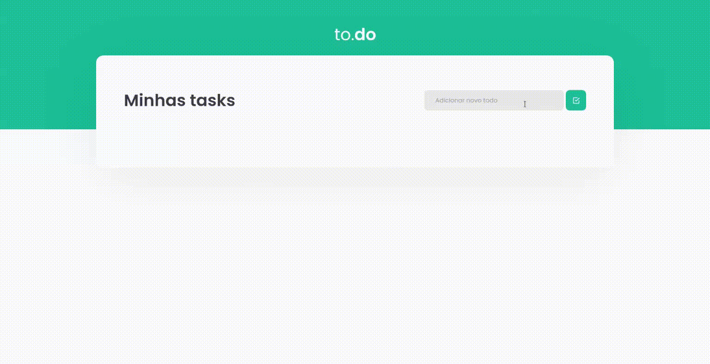

<h1 align= "center">

</h1>

  <a href="#-tecnologies">Desafio</a>&nbsp;&nbsp;&nbsp;|&nbsp;&nbsp;&nbsp;
    <a href="#-tecnologies">Tecnologias</a>&nbsp;&nbsp;&nbsp;|&nbsp;&nbsp;&nbsp;
      <a href="#-tecnologies">O que aprendi</a>&nbsp;&nbsp;&nbsp;
 

<h1>

## 💻 Desafio

Nesse desafio o principal objetivo é a concepção de uma pequena aplicação de atividades a fazer, para treinar um pouco mais sobre manipulação do estado no ReactJS.

<h1>

## 🚀 Tecnologias

 

---

## 🚀 O que eu aprendi ...

 

Aprendi que, para entender o funcionamento do React é necessário ter em mente alguns conceitos fundamentais que dizem respeito a funções. Outro importante aprendizado, foi sobre a utilização do Typescript no processo de criação do aplicativo, que trouxe várias melhorias no processo do desenvolvimento, como códigos mais ordenados e
fácil detecção de erros.

---

Feito com ♥ by Jaqueline Pires
